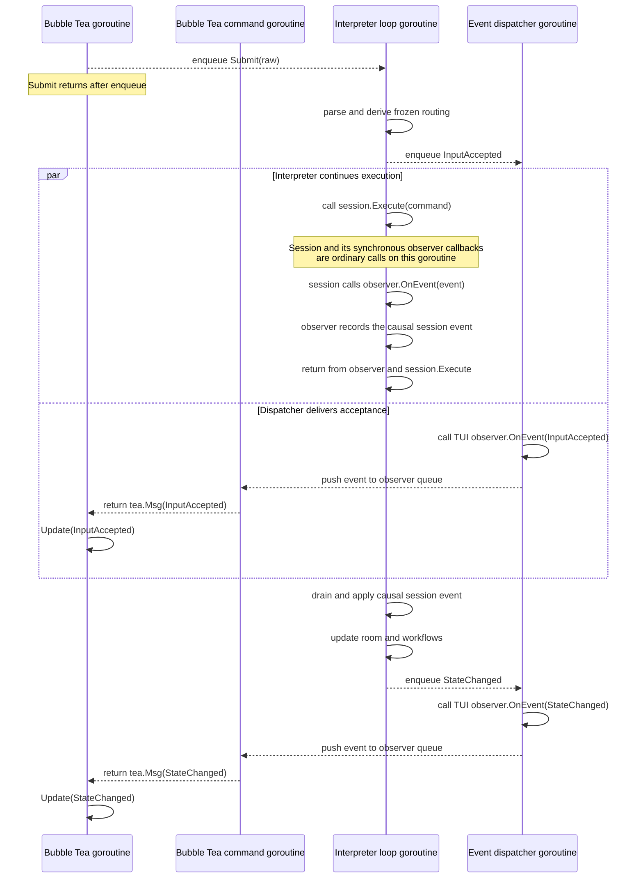
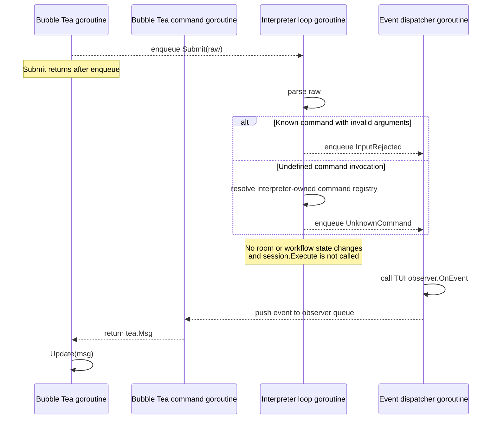

# Package design: internal/interpreter

See [`pkg-interpreter-workflows.md`](pkg-interpreter-workflows.md) for the
workflow and instruction boundary used to keep this package's serialized coordinator
focused.

## Scope

The interpreter is coderoom's UI-independent application layer. It accepts
prompt-language input, coordinates its execution, and exposes observable state
and events to front ends.

The dependency direction is:

```text
internal/ui -> internal/interpreter -> internal/session
                                  \-> internal/room
                                  \-> internal/participant
                                  \-> internal/promptlang
                                  \-> internal/shell
```

`internal/interpreter` must not import `internal/ui` or Bubble Tea. The TUI
must not call or observe `internal/session` directly. A future non-interactive
runner should be able to use the same interpreter without reproducing TUI
behavior.

The interpreter owns:

- parsing submitted text into `promptlang.Statement` values
- the room-scoped command-definition registry
- translation of statements into session commands
- shell-definition invocation and shell-process lifetime
- bounded-loop state and coordination
- staged-submission planning, frozen routing, pending state, lifecycle
  transitions, and atomic edit/discard/interrupt operations
- the canonical `room.Room` projection used during execution
- serialized calls to `session.Execute`
- application-level events and snapshots consumed by front ends

It does not own:

- participant or agent runtime invariants
- participant color allocation
- agent process I/O
- session routing and policy enforcement
- prompt-language grammar
- terminal presentation, focus, key bindings, or styling

## Construction and public boundary

The interpreter is the application facade presented to the UI:

```go
type Interpreter struct {
    model    *interpreterModel
    executor *interpreterExecutor
}

func New(ctx context.Context, sess SessionController, cwd string, opts ...Option) *Interpreter
func (i *Interpreter) Submit(raw string) error
func (i *Interpreter) ResolveApproval(id int64, choice ApprovalChoice) error
func (i *Interpreter) Snapshot() Snapshot
func WithObserver(Observer) Option
func (i *Interpreter) Close()
```

Application event observers are configured once, before execution starts:

```go
observer := ui.NewObserver()
interp := interpreter.New(ctx, sess, cwd, interpreter.WithObserver(observer))
model := ui.New(interp, observer, cwd)
```

`WithObserver` installs the outgoing application event consumer. The session
observer is a separate incoming runtime-event port used internally by the
interpreter; front ends do not register with the session.

`Submit` is the only prompt-language entry point. User-authored `/cancel`,
`/invite`, `/remove`, sends, and every other language statement all use this
path. The facade must not add methods such as `Cancel(alias)` that duplicate a
statement and create a second execution path.

`Submit` returns nil when the operation is enqueued. A front end
transfers ownership of the submitted input—and may clear its composer—only on
success. It returns `ErrClosed` after interpreter shutdown begins.

Dedicated methods are reserved for structured interactions that are not prompt
language: resolving an approval, reading a snapshot, shutdown, and atomic
staged-submission editing, discard, and interrupt-and-dispatch. The boundary
invariant is that front ends express intent to the interpreter and do not
receive the underlying `*session.Session`.

`Snapshot` contains the application state needed for presentation, including
the canonical room snapshot, participant roster, and optional detached
`StagedSubmission`. It contains values, not live session or room objects. The
roster uses `participant.View`, the safe
observable portion embedded in the live `participant.Participant`. This keeps
participant fields and domain types canonical while preventing front ends from
receiving agent capabilities or runtime bookkeeping.

### Submission source locations

Command preparation receives the parser's `ParsedStatement`. Submission acceptance,
success, failure, unknown-command and shell-completion events carry that same
located statement. Deferred stage and loop state retain it; asynchronous shell
requests retain their own source so stale results cannot acquire a replacement
workflow's locations. Operational failures from staged work also carry the source.

Runtime errors use `promptlang.Diagnostic`, preserving their underlying errors
through `errors.Is` and `errors.As`. Existing parser and registry diagnostics are
preserved. Native argument failures identify the relevant argument; shell failures
identify the submitted program or command reference, and loop condition failures
identify the condition reference. Other failures use the whole statement span.
The pending-stage admission gate still runs before parsing and identifies the
complete rejected submission.

### Internal ownership

`Interpreter` is only the public facade and composition root. Its two fields
have distinct responsibilities:

- `interpreterModel` owns the canonical room, command registry, approvals, and
  workflow state. It is confined to the serialized operation loop and returns
  `instructionSequence` values without executing them.
- `interpreterExecutor` owns operation serialization, session and shell I/O,
  asynchronous worker lifetime, the instruction runner, session-event inbox,
  event dispatcher, shutdown, and the immutable snapshot cache.

The executor depends on the model through a narrow internal port. The model
does not enqueue operations, perform I/O, publish events, or call back through
the facade. Operations apply to the executor rather than `*Interpreter`, so
adding workflow transitions cannot grow facade implementation methods.

The operation loop refreshes the immutable snapshot cache. Accepted snapshot
reads are serialized after prior session events; reads after shutdown return a
detached cached value without accessing mutable model state.

### Session dependency

The interpreter accepts the narrow session behavior it consumes rather than a
concrete `*session.Session`. The interface is declared by the interpreter:

```go
type SessionController interface {
    Execute(session.Command) error
    AddObserver(session.Observer)
    CreateParticipantSendPlan(alias string) session.ParticipantSendPlan
    Participants() []participant.View
    Participant(alias string) (participant.View, bool)
    Shutdown()
}
```

Participant queries return detached `View` values with actual status, startup
readiness, and turn identity. The interpreter selects its shared-room recipients
using View predicates; Session supplies all registered participants in one
locked list rather than separate roster, routable, or barrier APIs.
Send and broadcast planning freezes known recipients, including startup,
preparing, and keepalive states. Crashed states remain in the planning snapshot
for error classification but are excluded from broadcast and notice recipients.

This interface describes the existing session behavior. `SessionController`
is the interpreter's internal dependency port, not the facade presented to
front ends. Implementation should
prefer replacing overlapping participant queries with one immutable snapshot
if that makes the contract smaller without changing routing semantics.
Production supplies `*session.Session`; tests use a recording fake that can
emit synchronous observer events and detect concurrent `Execute` calls.

The interface is internal plumbing, not part of the front-end facade. Session
commands, observers, and routing plans do not escape through interpreter events
or snapshots. Participant views may appear in snapshots; front ends may depend
on `internal/participant`, but not on `internal/session` or `internal/agent`.

### Language submissions and structured operations

The distinction between facade operations is semantic:

| Intent | Entry point | Reason |
|---|---|---|
| User enters `/cancel ada` | `Submit("/cancel ada")` | It is prompt language |
| User enters `/invite ada` | `Submit("/invite ada")` | It is prompt language |
| User chooses an approval option | `ResolveApproval(...)` | Structured response to an active request |
| User reads observable state | `Snapshot()` | Returns a detached current or post-shutdown cached view |

The staged-submission facade also exposes atomic structured operations:

| Intent | Entry point | Reason |
|---|---|---|
| User returns a staged message to editing | `TakeStageForEdit()` | Atomically removes and returns its raw draft |
| User abandons a staged message | `DiscardStage()` | Removes it without dispatch |
| User requests interrupt-and-send | `InterruptAndDispatchStage()` | Acts on the staged submission's frozen readiness requirements |

`InterruptAndDispatchStage` is not an alias for `/cancel`: it derives the
blocking participants from the staged submission, requests their cancellation
through the serialized execution loop, and waits for lifecycle events before
dispatch. Its `true` result means the workflow was initiated, not that dispatch
has completed. Successful per-alias cancellations remain acknowledged; after a
partial failure, retries target only the failed aliases. A request with no
uncancelled blocker returns `false`, so cancel commands are not issued twice.
`TakeStageForEdit` atomically removes and returns the raw draft so the UI can
restore it to the composer. `DiscardStage` permanently abandons the staged
submission. A `false` result means no applicable stage action existed when the
interpreter processed the operation and no action was taken.

### Approval boundary

Approval state exposed to front ends uses interpreter-owned types:

```go
type Approval struct {
    ID      int64
    Alias   string
    Prompt  string
    Options []ApprovalOption
}

type ApprovalOption struct {
    ID    string
    Label string
}

type ApprovalChoice struct {
    OptionID string
}
```

The exact fields follow the approval capabilities required by the UI, including
any command or file-change context needed for an informed decision. The
interpreter translates between these values and agent/session approval protocol
types. Front ends do not import `internal/agent` for approval handling. These
types should not be aliases of agent protocol types because the application
contract and backend protocol evolve for different reasons.

## Execution loop

`session.Execute` must be called from one goroutine. The interpreter enforces
this structurally with one serialized execution loop rather than relying on
each caller to coordinate correctly.

Inputs to that loop include:

- submitted prompt text
- explicit operations such as approval resolution and cancellation
- session events relevant to workflows
- completed shell executions
- shutdown

Shell programs and agent readers may run concurrently, but their results are
placed back onto the interpreter queue before interpreter state is mutated or
another session command is executed. Command definitions and active loop state
therefore need no independent synchronization.

Session observers are invoked synchronously by the goroutine emitting an
event, including from inside `session.Execute`. The interpreter's observer
must enqueue and return immediately. It must never wait for the execution loop,
otherwise a synchronous event emitted during `Execute` can deadlock the loop.

### Goroutine ownership and successful submission

`Submit` only enqueues work; it does not parse or execute on the caller's
goroutine. The interpreter loop is the sole owner of workflow mutation and the
sole caller of `session.Execute`. A synchronous session notification therefore
runs briefly on that same goroutine, but the interpreter observer only records
the event for later processing and returns. After `session.Execute` returns,
the interpreter loop drains and projects those causal events before accepting
the next external operation.



Interpreter events are delivered from a separate dispatcher. UI observers do
not mutate the Bubble Tea model directly; they push events into a queue. A
blocking Bubble Tea `tea.Cmd` reads that queue and returns a `tea.Msg`, which
Bubble Tea then supplies to `Update` on its own goroutine.

Session events emitted synchronously during an operation are causally part of
that operation. The loop drains and applies them before it begins a later
external submission, even if that submission was already waiting in the
operation queue. Otherwise a later command could plan against stale participant
or room state. This may be implemented with a separate session-event inbox or
an equivalent priority/drain mechanism; it must not rely on ordinary FIFO
insertion timing. The runner projects the complete synchronous event burst
before executing any instructions derived from those events, so those
instructions observe all changes produced by the dispatch.



## Submission

`Submit` parses the complete user submission through `promptlang.Parse`. Parse
errors and unknown commands become interpreter events; they are not rendered
inside the interpreter.

Before parsing, `Submit` checks staged-submission state
on the interpreter loop. If a stage exists, the submission is rejected with
`InputRejected{Raw: raw, Err: ErrStagePending}`. This preserves the current
single-stage policy:

- the raw input is not parsed or appended to room history
- `InputAccepted` and `UnknownCommand` are not published; `InputRejected` is
  the terminal outcome
- the existing stage is neither replaced nor modified
- native handlers are not executed
- `session.Execute` is not called

The TUI decides how to render `ErrStagePending`. The user may proceed only
through the dedicated stage operations: take for edit, discard, or
interrupt-and-dispatch. Because the stage check and rejection run on the
interpreter loop, they are atomic with auto-dispatch and other stage
transitions.

```go
var ErrStagePending = errors.New("submission blocked by pending stage")
```

A known command with malformed or missing arguments produces `InputRejected`.
A syntactically valid command invocation that is absent from the
interpreter-owned command registry produces `UnknownCommand`. Neither outcome
appends a room record, publishes `InputAccepted`, calls `session.Execute`, or
changes workflow state.

Command-definition names are parsed as identifiers before registry policy is
applied. A reserved or previously defined name is therefore accepted input and
terminates with `SubmissionFailed`, classified as `ErrorReservedCommand` or
`ErrorCommandExists`. Event consumers can branch on `ErrorCode` without
inspecting presentation-oriented error strings.

Every successfully enqueued `Submit` produces exactly
one terminal outcome. Rejection and unknown routing are already complete
outcomes; they do not need a second confirmation event. Recognized input first
publishes `InputAccepted`, then finishes with either `SubmissionSucceeded` or
`SubmissionFailed` after synchronous causal session events have been
projected.

| Situation | Ordered submission events |
|---|---|
| Enqueue refused after shutdown begins | No events; the method returns `ErrClosed` |
| Stage pending or syntax/argument rejection | `InputRejected` |
| Valid statement with no native handler | `UnknownCommand` |
| Recognized command executes or schedules successfully | `InputAccepted` → zero or more domain/`StateChanged` events → `SubmissionSucceeded` |
| Recognized command execution fails | `InputAccepted` → zero or more causal domain/`StateChanged` events → `SubmissionFailed` |

These combinations are mutually exclusive: `UnknownCommand` never follows
`InputAccepted`, and neither rejection nor unknown routing is followed by a
generic completion event. Submission success means execution or scheduling
succeeded; it does not mean asynchronous work started by the command has
finished. For example, `/invite` may publish `SubmissionSucceeded` while its
participant is still `Starting`, before `AgentReady`.

Shutdown flushes every terminal outcome from successfully enqueued submissions
through the observer dispatcher before closing it, so the TUI cannot retain a
submission gate whose outcome was discarded during `Close`.

For a valid statement, the interpreter:

1. derives the frozen routing information needed to represent the submission
2. publishes acceptance of the user input
3. executes or schedules the statement
4. publishes its observable result

Existing syntax and behavior remain unchanged. Built-ins that are purely
presentational, such as the exact formatting of `/help`, may remain UI
presentation data, but recognition of the statement and its execution outcome
belong to the interpreter. `/quit` produces a quit request; a front end decides
how its own event loop exits after interpreter shutdown begins.

## Events and observation

Consumers observe typed interpreter events rather than scraping strings from
the rendered transcript. Representative event categories are:

```go
type InputAccepted struct {
    Raw     string
    Routing []string
}

type InputRejected struct {
	Raw  string
	Code ErrorCode
	Err  error
}

type UnknownCommand struct {
    Raw  string
    Name string
}

type SubmissionSucceeded struct {
    Raw string
}

type SubmissionFailed struct {
	Raw       string
	Operation string
	Code      ErrorCode
	Err       error
}

type ShellCompleted struct {
    Command string
    Cwd     string
    Result  shell.Result
}

type LoopStatus struct { Message string }

type StateChanged struct {
    Snapshot Snapshot
}

type ExitRequested struct{}
```

This list describes the semantic boundary, not a required one-to-one API.
Events should carry structured data where callers need to act on or test the
result. Compatibility text may be included where current transcript wording
is user-visible, but it must not be the only representation of execution.

The interpreter is the only session observer exposed to the application layer.
For each session event it:

1. applies the event to its canonical room projection
2. updates interpreter workflows, such as a loop waiting for an idle agent
3. refreshes the immutable interpreter snapshot cache when requested
4. publishes interpreter events to consumers

This explicit order prevents the UI from racing two independently paced
session observers and removes the need for UI-side observer draining.

## Staged submissions

The interpreter workflow owns the staged-submission state machine for
user-authored `Send`, `Broadcast`, and `Handoff` statements in the running TUI.
Composer staging is its UI representation, not its source of truth.

On submission, the interpreter freezes the routing plan and required-ready aliases. If
the required participants are ready, it dispatches immediately. Otherwise it
stores the pending execution and publishes its state. Relevant session events
then advance it:

- readiness combines actual status with StartupReady; an idle participant still
  completing startup stays blocked until AgentReady
- broadcasts and policy-enabled send notices include participants already
  starting when submitted; later invites do not join the frozen routing plan
- unknown and crashed direct targets produce distinct errors
- idle or started participants may make the submission dispatchable
- stopped or crashed targets are marked unavailable
- a handoff waits for source output completion only during active turns;
  startup and keepalive wait for readiness, then read existing output or fail
  clearly when there is no completed source output
- unrelated startup and maintenance bystanders do not block a handoff
- partial delivery reports the aliases that accepted the execution

The front end may request edit/discard or interrupt-and-dispatch. An interrupt
request causes the interpreter to issue serialized cancel commands for blocking
participants with active turns. Startup and maintenance participants continue
waiting. The interpreter publishes progress and dispatches only when lifecycle
events satisfy the frozen readiness requirements. The UI never calculates stage readiness or
advances stages from its own session-event projection.

Representative state supplied to front ends is structured:

```go
type StagedSubmission struct {
    Raw        string
    Routing    []string
    NotReadyAliases []string
    Interruptible []string
    Unavailable []string
    InterruptRequested bool
    Phase      StagePhase
}
```

There is at most one composer-originated staged submission, matching current
behavior. Interpreter-owned command composition may later schedule independent
child executions; it must not reuse this single composer slot.

### Atomic stage operations

Stage operations are synchronous request/response operations implemented on the
existing interpreter queue. Each request carries a buffered one-shot response
channel. The execution loop examines and mutates the current stage, publishes
the resulting state change, and replies as one serialized operation. No stage
state is read or modified outside that loop.

```go
type takeStageForEditOperation struct { result chan stageOperationResult }
type discardStageOperation struct { result chan stageOperationResult }
type interruptAndDispatchStageOperation struct { result chan stageOperationResult }

type stageOperationResult struct {
    raw string
    ok  bool
}
```

The contract is deliberately based on processing order: an operation acts on
whatever stage exists when the interpreter loop processes it. It does not
target a stage from a previously rendered snapshot. If auto-dispatch has
already consumed the stage, the operation returns `false`.

The one-shot channel is buffered so the execution loop cannot be stranded if a
caller stops waiting during shutdown. Enqueue rejects new operations after
shutdown begins, and callers wait for either their response or interpreter
completion. `Close` must reject or resolve requests that were accepted but not
processed. These blocking methods must never be called from the interpreter
loop or its session observer callback.

The Bubble Tea adapter invokes stage operations from a `tea.Cmd`, then sends
their result back through a Bubble Tea message. It does not block `Update` while
waiting for the interpreter loop.

V1 assumes one sequential interactive front end. If concurrent controlling
clients are introduced, stage IDs or optimistic snapshot versions can extend
this contract without changing the serialized state owner.

## Room ownership and transcript delivery

The interpreter owns the canonical live `room.Room` used for execution and
transcript content. The TUI owns rendering, composer, focus, scrolling, and
approval presentation. Its production room presenter has no room actor or
session observer.

Canonical records arrive exclusively through ordered `TranscriptChanged`
events. Each event carries a detached `room.Delta`: stable canonical record
indices, changed records, and full stream/departure metadata. The model captures
each mutation synchronously on the interpreter loop, and the instruction runner
publishes those changes before the next semantic result or state snapshot.
`InputAccepted` precedes its input record delivery. Synchronous causal records
arrive before submission completion. Dispatched input precedes the handoff
audit; shell output and loop records use this same stream. Repeated delta
versions are ignored by the presenter.

`StateChanged` snapshots supply roster, approval, and stage state. `Snapshot.Room`
is a detached inspection/bootstrap contract, not a live record delivery path.
Observers are installed through `WithObserver` during interpreter construction,
before startup. The first event is an initial `StateChanged` snapshot, followed
by application events in publication order, including synchronous startup
callbacks. The UI queue is created first, installed on the interpreter, and
passed alongside the interpreter to `ui.New`; events wait there until the UI
consumes them. The UI does not query snapshots or register observers after
startup. A new observer cannot attach to an already-running interpreter.
Live snapshots never replace transcript records. Semantic `InputAccepted`,
`StagedInputDispatched`, `HandoffCompleted`, `ShellCompleted`, and `LoopStatus`
events remain available to consumers but do not append duplicate TUI records.
Stage dispatch/discard events still control draft restoration and ordering.

Help formatting, startup tips, debug output, and event-formatted notices are
local presentation records. A deterministic canonical-to-display index table
accounts for their insertion and translates stream indices. This is an append
and update adapter, not reconciliation: only interpreter deltas decide
canonical record content, and there is no independently observed session room
to merge, compare, or roll back.

Projection coverage mapping for the cutover:

| Former production path | Replacement coverage |
| --- | --- |
| Independent session/room observers for lifecycle, log, output, reasoning, flush, departure | Retained `model_test.go` scenarios through canonical room deltas and interpreter DTOs; `TestTranscriptProjection_updatesCanonicalStreamAroundPresentationNotices` |
| Session roster queries and approval events | Interpreter `StateChanged` roster/approval projection; retained native lifecycle and approval adapter tests |
| UI echoes of accepted/dispatched input and handoff audit | Retained native send/broadcast/handoff lifecycle tests; `TestTranscriptProjection_semanticEventsAndSnapshotsDoNotEchoRecords` |
| UI shell, definition, and loop record appends | Interpreter canonical record stream; adapted shell/definition/loop presentation tests |
| Independent observer draining to tighten ordering | Serialized canonical changes; `TestTranscriptStream_acceptancePrecedesRecordsAndCausalUpdatesPrecedeCompletion` |
| Composer gate, edit/discard/interrupt, approval overlap, failed dispatch | Retained submission, stage-operation, stage-presenter, and native lifecycle tests |

Test-only session observers in native lifecycle tests provide an external
runtime oracle; they are not a TUI application-state source.

## Handoff source resolution

For staged submissions, the latest eligible handoff source is
application state derived from completed
room-visible agent output. The interpreter resolves it from its own canonical
room immediately before dispatch:

```go
source, ok := model.ReadHandoffSource(fromAlias)
if !ok {
    // publish a rejected execution result
    return
}

err := gateway.Execute(handoffRequest{
    FromAlias:   fromAlias,
    ToAlias:     toAlias,
    requiredReadyAliases: requiredReadyAliases,
    source:      source,
})
```

`HandoffCommand` receives the resolved `session.HandoffSource` value. It does
not receive a resolver callback. Session remains responsible for participant
validation, readiness validation, delivery, and the `HandoffDelivered` and
`RoutingCompleted` runtime events. The interpreter is responsible for selecting the room-visible source.

The source's record index refers to the interpreter-owned canonical room
snapshot. Because the UI renders snapshots from that same room, the audit index
and handoff-source marker cannot diverge between execution and presentation.

If the source is working, the stage waits for both its terminal idle status and
the matching completed `AgentMessage` projection before reading the source.
Either event may arrive first. This prevents dispatch from racing canonical
room projection while ignoring unrelated or late-joining participants outside
the frozen readiness requirements.

## Loops

The interpreter owns one active bounded loop per room, preserving current
behavior. A loop alternates between:

1. dispatching a participant turn
2. waiting for the participant's terminal idle transition
3. evaluating the named shell-backed condition
4. finishing on success/cancellation or dispatching another turn on failure

The loop state machine consumes queued session events and shell completions on
the interpreter loop. It never calls `session.Execute` from an agent reader or
shell goroutine. Participant stop and crash events terminate the loop with the
same user-visible behavior as today.

## Shell lifetime and shutdown

Shell execution uses a child of the interpreter context. Closing the
interpreter:

- stops accepting new submissions
- cancels active shell processes
- requests session shutdown
- waits for interpreter-owned shell work to finish
- closes observer delivery

Shutdown must not leave shell process groups running. Repeated close calls are
safe. A UI exit request and application-context cancellation use the same
shutdown path.

## Testing

Interpreter tests use fakes at its session and shell boundaries and preserve
the existing definition, shell, and loop scenarios moved from `internal/ui`.
Interpreter tests cover staged planning and lifecycle decisions; native TUI
tests retain dispatch ordering, transcript, composer, and approval behavior. Coverage must include:

- unchanged parsing and command behavior
- typed observation of acceptance, rejection, shell, and loop results
- synchronous session observer callbacks without deadlock
- all `session.Execute` calls occurring serially on the execution loop
- shell cancellation and close waiting for completion
- participant stop/crash while a loop is active
- post-shutdown reads from an immutable, detached snapshot cache
- model-owned approval transitions without workflow synchronization
- a package dependency check that rejects UI or Bubble Tea imports

The interpreter now covers frozen stage planning, pending snapshots, immediate
and lifecycle-delayed send/broadcast dispatch, target departure, partial
delivery, the pending-stage submission gate, handoff ordering, and atomic
stage actions with race and shutdown scenarios. The interpreter workflow is
authoritative for all three staged actions in the interactive application;
there is no UI-owned batch state or legacy stage dispatch path.

### `Submit` contract tests

The `Submit` contract is established before individual statement handlers are
migrated. Tests use a recording session fake with controllable `Execute`
blocking, synchronous observer callbacks, and active-call counters.

| Scenario | Required observation |
|---|---|
| Valid statement | `InputAccepted` is published once before its execution result; the input is represented once in room state. |
| Known command with invalid arguments | `InputRejected` is published; no room mutation, `InputAccepted`, or session execution occurs. |
| Undefined command invocation | `UnknownCommand` contains the raw input and command name; no room mutation, acceptance, or session execution occurs. |
| Native submission followed by another submission | The native execution and its causal session events complete before the later submission plans or executes. |
| Session execution failure | `SubmissionFailed` is the terminal outcome and its error remains structurally inspectable with `errors.Is`; neither `SubmissionSucceeded` nor success-only state is committed. |
| Synchronous session callback | `Submit` completes without deadlock; the callback is projected only after it is dequeued by the interpreter loop. |
| Sequential submissions | A later submission cannot execute before an earlier submission and its synchronously emitted session events are fully applied. |
| Concurrent submissions | Every resulting `session.Execute` call has at most one active invocation; order is the interpreter queue's acceptance order. |
| Submission during an active stage | `InputRejected.Err` wraps or equals `ErrStagePending`; that rejection is terminal; the input is not parsed or recorded, the existing stage is unchanged, and neither a native handler nor `session.Execute` runs. |
| Submission after shutdown | The submission returns `ErrClosed`, does not execute, and does not publish through the closed dispatcher. |

Every successfully enqueued scenario above publishes exactly one of
`InputRejected`, `UnknownCommand`, `SubmissionSucceeded`, or
`SubmissionFailed` as its terminal outcome. A submission refused synchronously
with `ErrClosed` was not enqueued and therefore publishes no event.

Execution compatibility has been removed. Native submission contract tests
cover error identity, causal-event ordering, sequential and concurrent execution,
and rejection after shutdown. Event dispatcher tests verify that shutdown
flushes accepted submission outcomes; stage-operation tests verify synchronous
request completion during shutdown.

The serialization test must cause multiple valid operations to reach
`session.Execute`; submitting the same consumable approval repeatedly is not
sufficient because later calls can fail validation before execution. The
ordering test gates the first fake `Execute`, submits a second command, and
proves the second cannot enter `Execute` until the first is released. The fake
also emits a synchronous state event from the first execution; the second
command must observe that projected state before it plans or executes.

### Dependency enforcement

The completed boundary is enforced by normal tests alongside each package.
`internal/interpreter/architecture_test.go` uses `go list` to reject transitive
interpreter dependencies on `internal/ui`, Bubble Tea, Bubbles, and Lip Gloss,
including legacy module paths and subpackages.
`internal/ui/architecture_test.go` lists all production UI packages and rejects
direct imports of `internal/session` and `internal/agent`. Test-only fixture
imports are excluded; UI transitive dependencies through the interpreter are
expected. Table-driven cases verify rejected and permitted relationships.
A separate interpreter structural test fixes `Interpreter` to model/executor
composition fields and compile-checks that operations target
`*interpreterExecutor`, not the facade.

The TUI constructs no session commands and owns no command registry, shell
execution, or loop workflow state. Production UI packages import neither session
nor agent. The CLI constructs the interpreter and owns shutdown; `ui.New` takes
the interpreter and its construction-time observer queue. `ui.Model.Close`
closes only its event queue.
Approval widgets consume `Approval`/`ApprovalChoice` DTOs. Transcript renderers
retain canonical room record values and use `CommandFromRecord` and
`FileChangesFromRecord` for detached tool details. Protocol constructors remain
in test fixtures only. The interpreter migration and package-graph enforcement
are complete.

## Routing outcomes

The instruction runner captures the single `session.RoutingCompleted` outcome
from each serialized routing command's event burst and passes its detached
`RoutingResult` through the existing workflow completion reference. Unrelated
agent/lifecycle messages may be present in the burst; no new send ID is needed.
Routing results themselves do not trigger redundant state snapshots. A routing
request without an outcome is a contract failure, preserving any execution error;
only non-routing requests may use a nil error as acceptance. The runner alone
commits accepted input records before the causal burst; stage completion only
publishes dispatch/outcome events.

Stage records and `StagedInputDispatched.Routing` use actual accepted recipients,
not planned aliases or a nil command error. Partial-success records also retain
failed and unattempted recipients for separate footers. These records precede
the causal burst, including fast agent output. No accepted recipients means no
committed staged user-input record. For handoff, only the destination is a
recipient; the source belongs to context metadata. Loops advance only after a
reported primary delivery, even if notice delivery fails.
